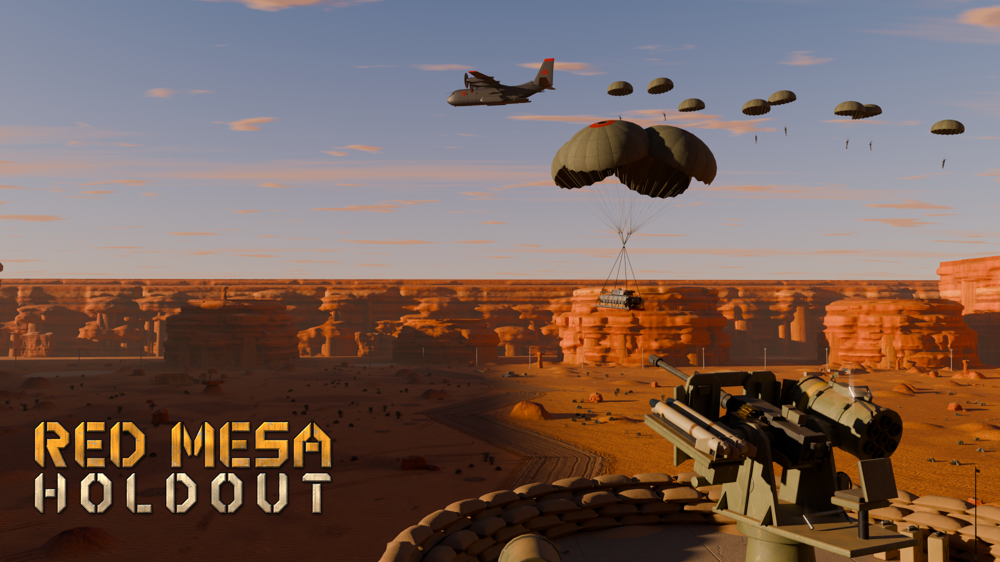
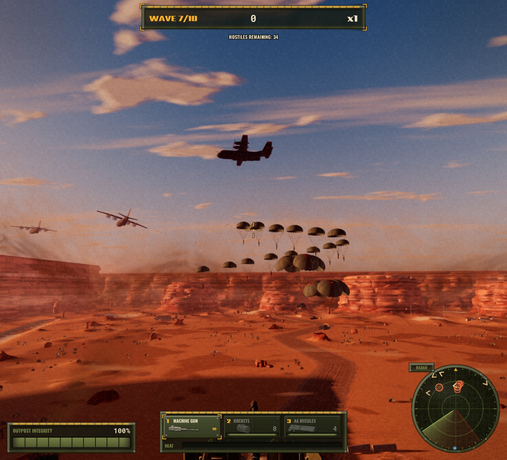
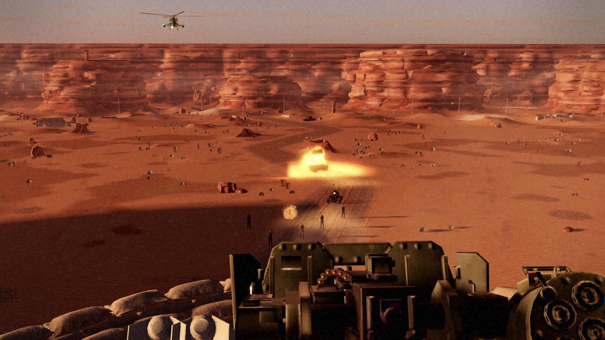
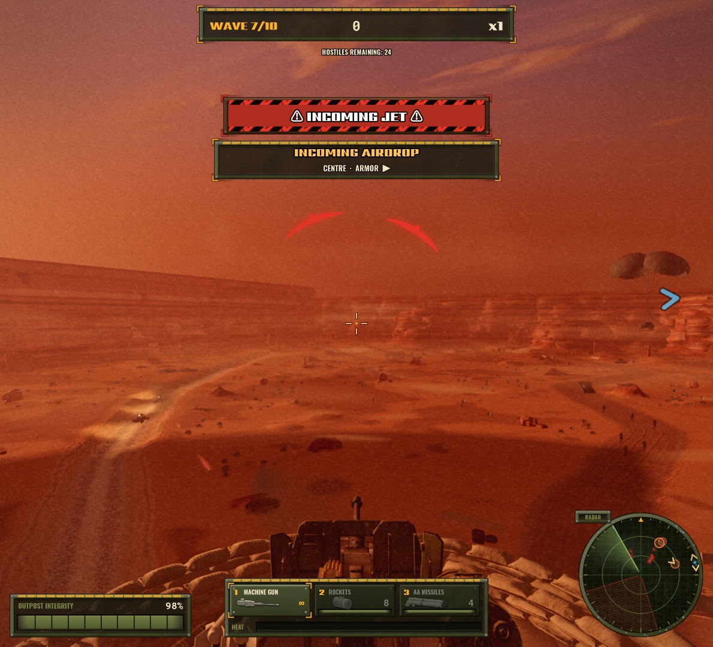
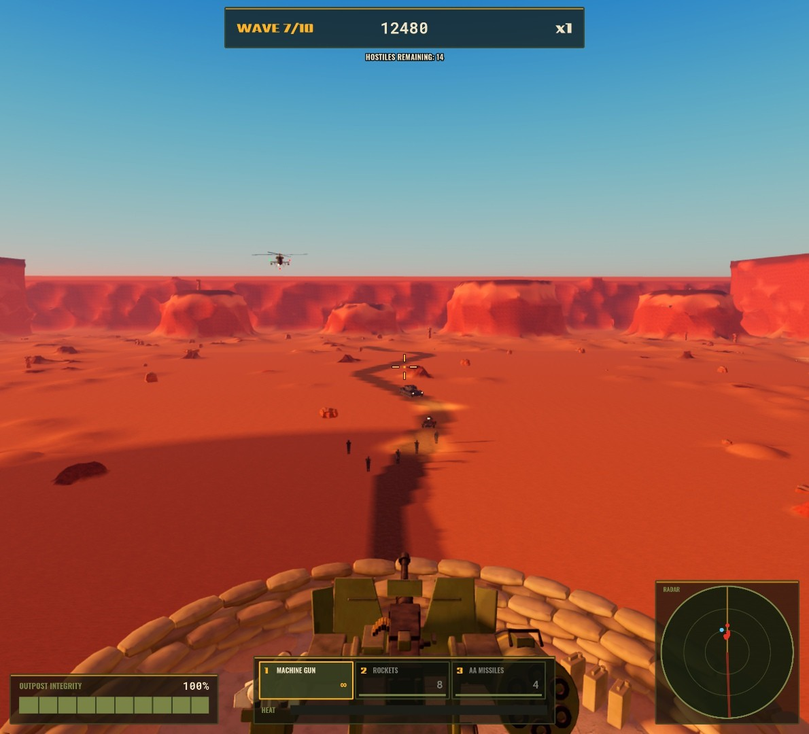
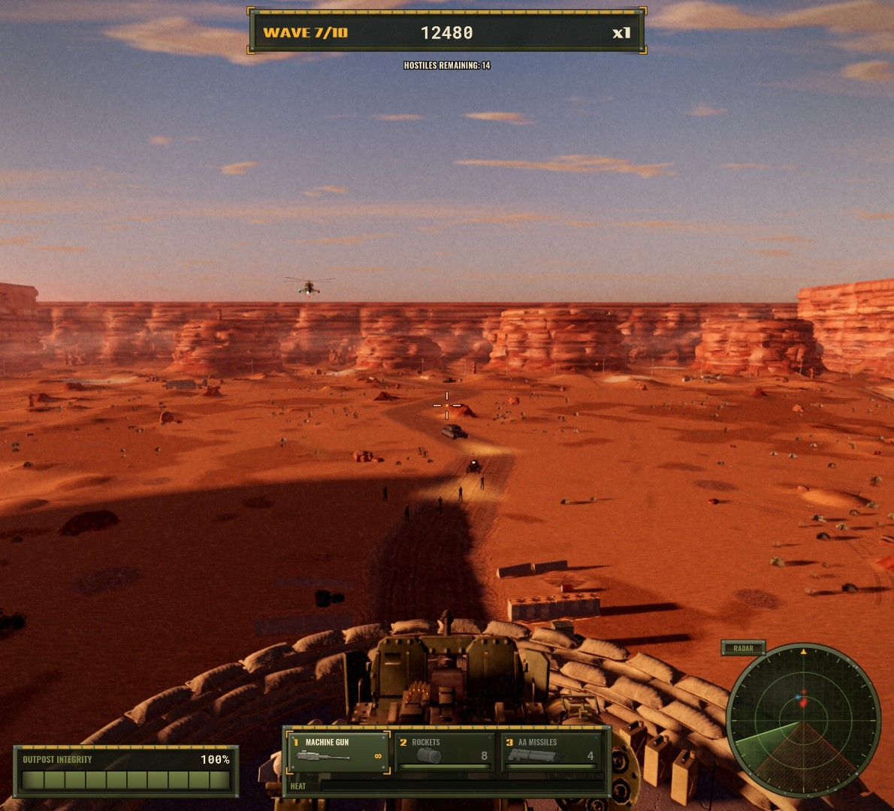
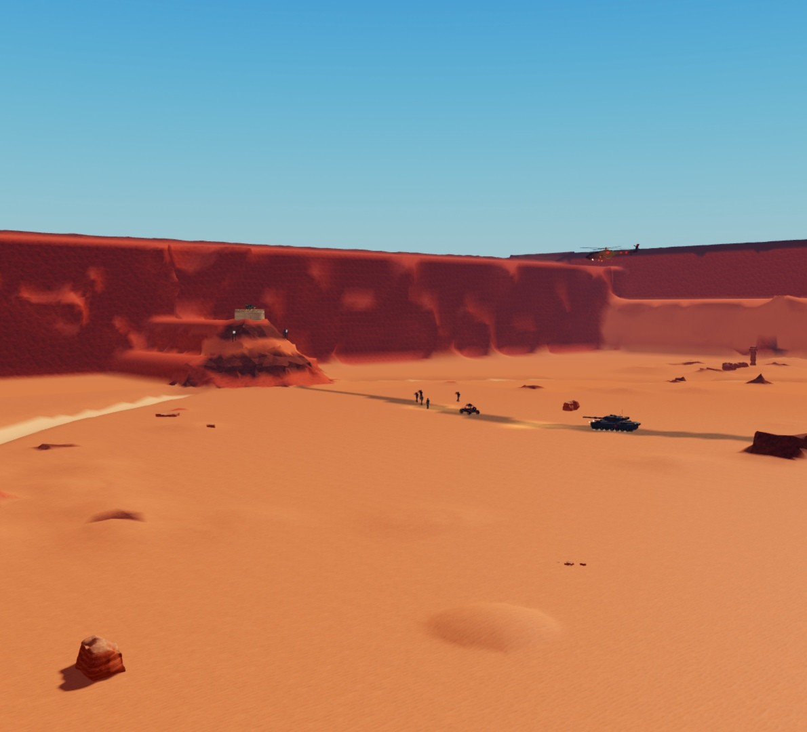
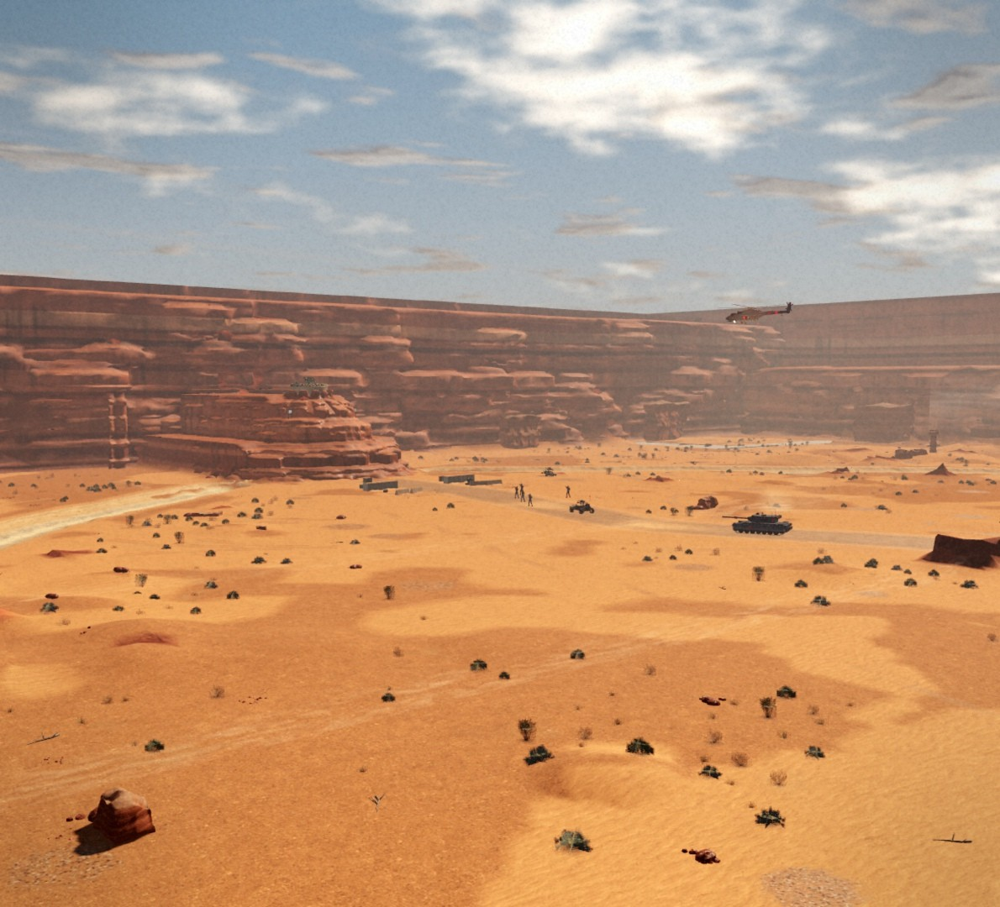
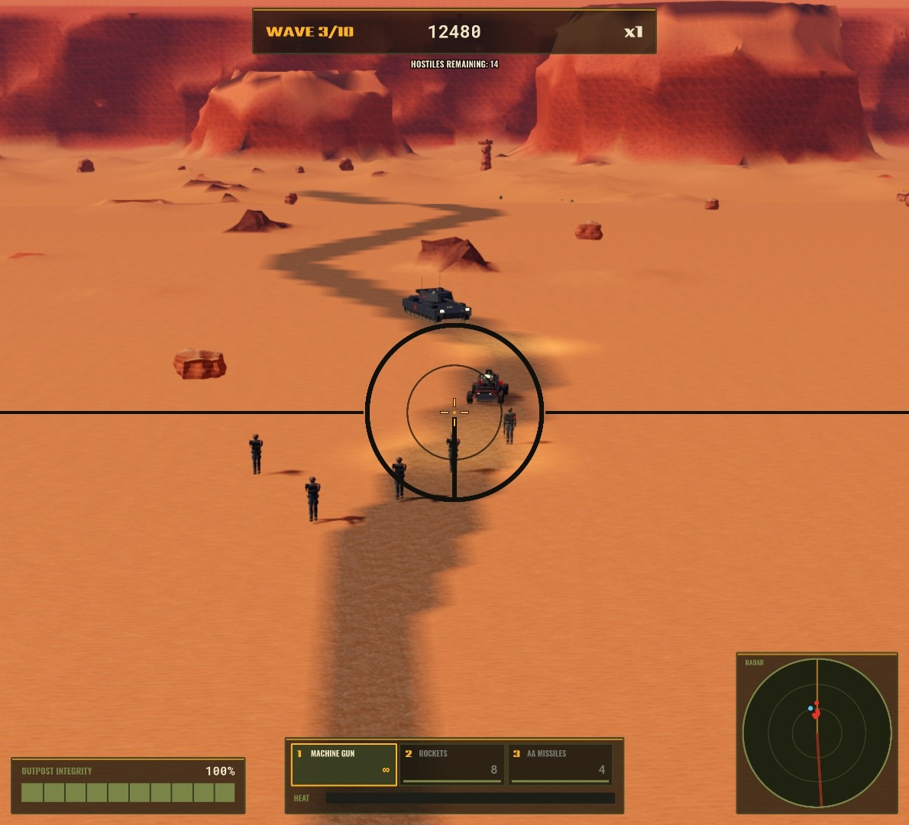
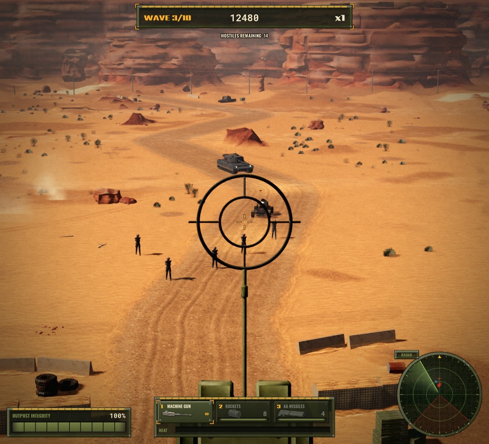

# Red Mesa Holdout

**Hold the mesa. Survive ten waves.** A single-player arcade defense shooter
for Roblox. You man a three-weapon gun emplacement on top of a red-rock
mesa while an enemy army parachutes into the canyon basin below: infantry,
buggies, tanks, helicopters, jets, and finally the Siege Crawler, a
95-stud land fortress.

## The game

- **One emplacement, three weapons.**
  - A machine gun that overheats.
  - Rockets for armour: 8 per wave, with splash damage.
  - AA missiles that need a one-second lock on aircraft.
  Switch with `1` `2` `3` or the mouse wheel; hold the right mouse button
  for the gunsight.
- **Enemies arrive by air.** Transports cross the sky and drop sticks of
  paratroopers and vehicles on cargo pallets anywhere across the basin,
  300–800 studs out. They're untouchable until they land, and then they
  advance on the mesa. You never know exactly where the next group comes
  down.
- **Ten escalating waves**, with a crate-drop resupply and repair between
  them:
  - The light moves from bright afternoon through late afternoon to a
    golden sunset for the finale.
  - Dust storms roll through on two of the waves.
- **The Siege Crawler.** Shoot off two side turrets and a charging main
  cannon with rockets, then destroy the exposed core, while its air-dropped
  escorts, helicopters and jets keep coming.
- **Readable, arcade-first:**
  - radar, off-screen threat arrows and jet warnings;
  - hit markers and combo scoring;
  - first-encounter tips;
  - Retry Wave from a checkpoint.

| Input | Action |
|---|---|
| Mouse | Aim the turret |
| Left mouse | Fire |
| Right mouse (hold) | Gunsight view |
| `1` / `2` / `3` | Machine gun / Rockets / AA missiles |
| Mouse wheel | Cycle weapons |

## Screenshots

**Airdrop.** Transports, a stick of paratroopers, and a tank under a
cargo-chute cluster:

**The fight.** A rocket hits a tank on the road at sunset, with a helicopter inbound:

**Dust storm.** Wave 7 at its peak:

**Before and after the visual overhaul** (same camera, same time of day):

| First playable build | Today |
|---|---|
|  |  |
|  |  |
|  |  |

More comparisons live in `qa/beauty/`: every milestone kept its before and
after beauty shots.

## How it was built

The whole project was built by a team of Claude agents working from a
written spec, with a human setting direction and answering design
questions. About 180 commits over roughly two days, in three stages:

1. **First playable to complete game** (`GAME_SPEC.md`, `DONE.md`). A lead
   agent plus Weapons, Enemies and Assets agents built the gameplay, the
   waves, the HUD, the original synthesized audio, and Blender hero assets
   uploaded through Roblox Open Cloud.
2. **Visual face-lift** (`docs/FACELIFT_PLAN.md`), which moved the look
   from "a Roblox game" to grounded semi-realism:
   - PBR terrain materials and painted skyboxes;
   - landscape meshes with real strata;
   - re-keyed lighting;
   - hard-surface rebuilds of the emplacement and every vehicle;
   - skinned, bone-animated infantry;
   - rendered flipbook effects;
   - a textured HUD;
   - client-side motion smoothing.
3. **Update 2** (`docs/AIRDROP_ENVIRONMENT_PLAN.md`):
   - airdrop arrivals, with a wave retune;
   - a denser, lived-in battlefield;
   - depth haze and film treatment;
   - wind, dust devils, birds and dust storms;
   - new title art;
   - daylight-only lighting to keep the busiest waves within budget.

Each milestone was built by one agent and checked by a separate reviewer
agent. The reviewer read the diff and compared before/after screenshots,
and anything it flagged went back for a fix round. The team shared one
Roblox Studio through a first-come-first-served lock, ran Blender headless,
and kept files separated by ownership rules (`docs/FACELIFT_TEAM.md`,
`docs/ARCHITECTURE.md`). Budgets are tracked in `docs/PERF_BUDGET.md`:
60 fps on a mid-range PC at graphics level 8, with readable enemies at
every time of day.

## Repository layout

| Path | What's there |
|---|---|
| `src/server/` | Server-authoritative game: wave director, airdrops, enemies, weapons, scoring, world and terrain builder, lighting |
| `src/client/` | Camera and aim, weapons, HUD and screens, effects, weather, enemy animation and motion smoothing |
| `src/shared/` | Config, wave table, weapon and enemy tuning, asset library, sky and terrain material ids, wind |
| `tools/assets/` | Blender asset pipeline (`rmh` library: modelling helpers, PBR materials with baked wear, trim sheets, high→low bakes, skinned meshes), Open Cloud upload and rbxmx export |
| `tools/env/`, `tools/vfx/`, `tools/ui/`, `tools/audio/` | Landscape, sky and terrain textures; flipbook renders; UI kit and key art; synthesized audio |
| `tools/qa/` | Beauty-shot rig and capture guide (`BEAUTY.md`), comparison and grayscale tools, perf probe, texture budget model, autoplay bots |
| `assets/` | Blender sources, exported meshes and textures, previews, Roblox model files |
| `qa/beauty/` | Before/after screenshots for every milestone |
| `docs/` | Plans, team contracts, architecture, asset pipeline, art bible, performance budget |

## Running it in Roblox Studio

1. Install [Rojo](https://rojo.space) 7.7 and its Studio plugin.
2. From the repo root: `rojo serve --port 34872`.
3. Open a new Baseplate in Roblox Studio, connect the Rojo plugin, and
   press Play. The battlefield is generated at start-up; give the terrain
   about 30 seconds to mesh.

**Asset note:** meshes, textures and sounds are uploaded to Roblox as
private assets owned by the original creator account, so a fresh copy
can't load them. The code falls back to simple placeholder shapes. To get
the real art, rebuild and upload the assets under your own account with
the Blender pipeline and an Open Cloud key (`docs/ASSET_PIPELINE.md`).

## Credits

- All models, animation, effects, UI and sounds were made for this project
  (Blender pipelines and synthesized audio in `tools/`).
- Some terrain, fabric and metal textures start from CC0 scans from
  [Poly Haven](https://polyhaven.com), heavily reworked. Every source is
  listed in `assets/source/CC0_CREDITS.md`.
- Built with Roblox Studio, Rojo, Blender and Claude.

## Known issues

- Machine-gun headshots on infantry don't register (hit volumes overlap).
- Hitscan has no lag compensation, so fast targets are harder to hit on
  high-latency connections.
- Aim feel and the audio mix still need more human playtesting.
