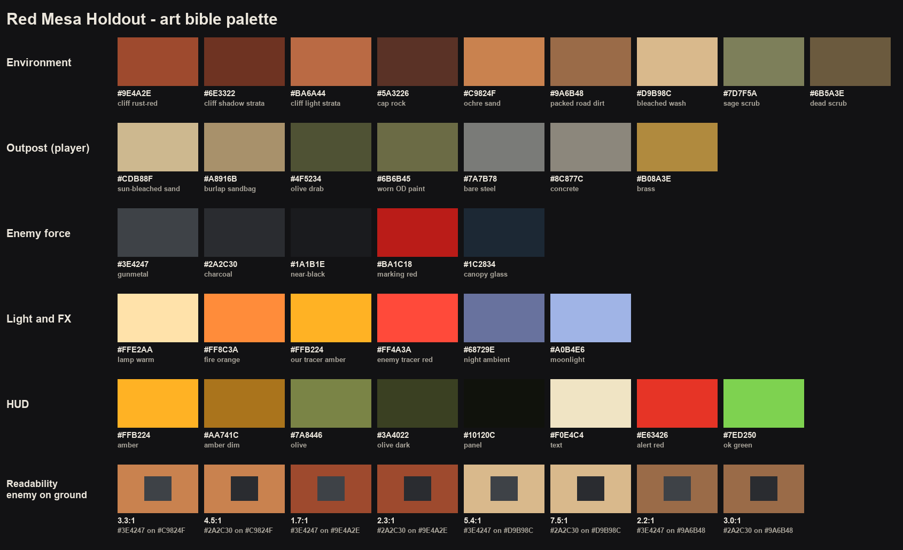

# Red Mesa Holdout — Art bible

The visual target for the face-lift (`docs/FACELIFT_PLAN.md` §2, GAME_SPEC
§13). Every workstream checks its work against this page and against the
beauty shots (`tools/qa/BEAUTY.md`). Owner: QA-tools; the light-key
reference shots are replaced as later phases land.

**One line:** a sun-baked Southwest canyon held by a dusty, hand-maintained
outpost, attacked by a dark, disciplined machine army — grounded
semi-realistic, PBR everywhere, real proportions, arcade readability.

---

## 1. Reference feel

- **Land:** layered red sandstone with horizontal strata, talus fans at the
  foot of every wall, pale dry washes, crusted sand with wind ripples,
  sparse grey-green scrub, heat haze over the basin by day.
- **Outpost (player):** sandbags, concrete and olive-drab steel that have
  been lived in — sun-bleached tops, dust packed in seams, chipped paint on
  every handle and edge, brass everywhere the gun has been fired.
- **Enemy force:** charcoal and gunmetal hardware with red markings and the
  chevron emblem. Clean silhouettes, dirty surfaces: dust gradient from the
  ground up, soot at exhausts and muzzles, chipped edges, roughness
  breakup. Never toy-clean, never rusty junk.
- **Light:** each time of day is a deliberate key (§4), not a default.

## 2. Palette

Generated by `tools/qa/py tools/qa/palette.py` (the script is the source of
truth; keep this table in sync).

| Group | Name | Hex | Use |
|---|---|---|---|
| Environment | cliff rust-red | `#9E4A2E` | mid-tone of mesa, canyon walls, buttes (spec §13) |
| | cliff shadow strata | `#6E3322` | dark bands, crevices, undercuts |
| | cliff light strata | `#BA6A44` | pale bands, ledge tops, bleached edges |
| | cap rock | `#5A3226` | hard cap layers on mesa and buttes |
| | ochre sand | `#C9824F` | basin floor (spec §13) |
| | packed road dirt | `#9A6B48` | road ruts, tracks |
| | bleached wash | `#D9B98C` | dry wash beds, salt crust (spec §13) |
| | sage scrub | `#7D7F5A` | live scrub, creosote |
| | dead scrub | `#6B5A3E` | dead branches, dry grass |
| Outpost | sun-bleached sand | `#CDB88F` | top faces of sandbags, dust drifts on the pit |
| | burlap sandbag | `#A8916B` | sandbag body |
| | olive drab | `#4F5234` | painted steel: gun cradle, ammo cans, crates |
| | worn OD paint | `#6B6B45` | faded/sun-bleached paint |
| | bare steel | `#7A7B78` | chipped edges, handles, barrel wear |
| | concrete | `#8C877C` | bunker, pit walls |
| | brass | `#B08A3E` | ammunition belt, casings |
| Enemy | gunmetal | `#3E4247` | main hull paint (Kit.GUNMETAL) |
| | charcoal | `#2A2C30` | secondary panels, uniforms (Kit.CHARCOAL) |
| | near-black | `#1A1B1E` | gun barrels, rubber, grilles |
| | marking red | `#BA1C18` | bands, numbers, emblem (Kit.RED) |
| | canopy glass | `#1C2834` | canopies, vision blocks |
| Light / FX | lamp warm | `#FFE2AA` | searchlights, headlights, emplacement lamps |
| | fire orange | `#FF8C3A` | fireballs, burning wrecks, flare glow |
| | our tracer amber | `#FFB224` | player tracers, rocket exhaust core |
| | enemy tracer red | `#FF4A3A` | enemy tracers and cannon glow |
| | night ambient | `#68729E` | night outdoor ambient |
| | moonlight | `#A0B4E6` | night key colour |
| HUD | amber / amber dim | `#FFB224` / `#AA741C` | primary accents, counters (client/Ui) |
| | olive / olive dark | `#7A8446` / `#3A4022` | panel trim, inactive slots |
| | panel | `#10120C` | translucent panel fill |
| | text | `#F0E4C4` | body text |
| | alert red / ok green | `#E63426` / `#7ED250` | threats, damage / pickups, confirmations |

## 3. Materials

Every visible surface gets a custom PBR set: `SurfaceAppearance` on meshes,
`MaterialVariant` on terrain and parts. Textures are ≤ 1024² (spec and
Roblox cap); large surfaces tile or use trim sheets. Texel density is
measured at the closest distance the surface is normally seen from.

| Surface class | Texture set (colour / normal / roughness / metal) | Texel density | Wear rules | Owner |
|---|---|---|---|---|
| Mesa, canyon walls, far wall, buttes (landscape meshes) | Strata material: world-space tiling sandstone + height-banded colour ramp (rust-red / light / shadow bands every 6–12 studs) + baked AO and curvature masks | ≥ 8 px/stud at close range, plus a detail layer | Dark crevices, bleached edges, desert-varnish streaks below ledges, pale dust on ledge tops, talus fans at the foot | ENV |
| Rock kit, boulders, talus | Shared rock set (same strata colours as the walls) | ≥ 16 px/stud | Dust on top faces, darker, damp-looking bases half-buried in sand | ENV |
| Basin floor (terrain `Sand`) | `MaterialVariant`: wind ripples + pebbles, 1024² seamless; second low-frequency variation to break tiling | `StudsPerTile` ~12–16 | Ripples perpendicular to the canyon axis; no visible repeat across 1 km | ENV |
| Road (terrain `Ground` + mesh strip) | Packed dirt with tyre ruts; road mesh with feathered alpha edges and gravel shoulders | `StudsPerTile` ~10; strip ≥ 8 px/stud | Ruts follow the lane; voxel material edge hidden under the strip | ENV |
| Washes (terrain `Salt` + bank strips) | Cracked dry mud, bleached; eroded lip + pebble-bed strips | `StudsPerTile` ~12 | Pale bed, darker damp-looking edges, pebbles collected in the channel | ENV |
| Terrain `Rock`, `Sandstone` (under/around meshes) | Strata-matched `MaterialVariant`s | `StudsPerTile` ~16 | Must match the landscape meshes where they meet | ENV |
| Scrub and ground dressing | Alpha-card leaves and branches, 3–4 variants; flat alpha meshes for tyre tracks and old craters | ≥ 16 px/stud | Density falls off with distance from the turret; lanes stay clear | ENV |
| Sky | 6-face skybox per preset rendered in Blender + Roblox `Clouds` | 1024² per face | Sun disc off (Roblox draws it), clouds, horizon haze, stars + milky band at night | ENV |
| Sandbags | Burlap weave, dust packed in seams; 3–4 lumpy cloth-sim shapes | ≥ 40 px/stud (hero) | Sun-bleached tops, damp dark bottoms, dust drifts against the base | HS |
| Concrete (bunker, pit) | Cast concrete with form lines, stains, cracks | ≥ 40 px/stud | Chipped edges, water/oil stains running down, sand in corners | HS |
| Gun steel (MG, rocket pod, missile rack, cradle) | Olive paint over bare steel, stencils ("7.62", unit number) baked in | ≥ 40 px/stud | Paint chipped to steel on edges and handles, oily darkening near the breech, heat discolouration on the barrel | HS |
| Brass (belt, casings) | Brass with tarnish variation | ≥ 40 px/stud | Bright on edges, dull in cavities | HS |
| Outpost props (ammo cans, crates, jerrycans, radio) | OD paint / plywood with stencils | ≥ 30 px/stud | Chipped corners, dust on tops | HS |
| Vehicle hulls (tank, buggy, Siege Crawler) | Trim sheets (panels, rivets, grilles) + baked high-poly detail; red markings and emblem baked as decals with chipping | ≥ 30 px/stud (crawler ≥ 40) | Curvature edge wear, AO grime, dust gradient up from the ground (lower third), roughness breakup, soot at exhausts and muzzles | HS |
| Tracks, tyres | Steel links / rubber tread | ≥ 30 px/stud | Caked dust and sand, polished contact faces | HS |
| Aircraft skins (helicopter, jet) | Panel seams, rivets, stencils, markings | ≥ 30 px/stud | Cleaner than ground vehicles; exhaust soot streaks, oil below the engines, rotor-wash dust on the lower fuselage | HS |
| Glass (canopies, lenses) | Dark tinted, low roughness | — | Dust film toward the frame | HS |
| Wrecks (`Wreck_*` swap) | Charred, rusted, paint blistered | same as the hull | Soot heaviest at the burn source, paint gone to bare metal | HS |
| Infantry | Charcoal camo fabric, plate carrier, pouches, gunmetal helmet with cover, skin, carbine; cloth folds in the normal map; 2–3 gear variants | ≥ 60 px/stud | Dust on boots and knees, worn fabric on elbows; red armband kept; slightly brighter helmet/shoulder rim for 500+ stud readability | CHAR |
| Particles | Custom 8×8 flipbooks, 1024² (fireball, oily smoke, dust puff, sand kick, muzzle flash ×3, rocket exhaust, missile trail, sparks) | — | No built-in Roblox particle textures | VFX |
| Beams | Textured tracers (hot core, soft falloff), dusty searchlight cones, shockwave rings | — | Our tracers amber, enemy tracers red | VFX / Look |
| HUD | 9-slice worn olive metal panels, stencilled edges, subtle scanline/noise overlay, icons rendered from the Blender models | — | Glanceable first (spec §12) | Look |

General wear rules for everything: dust gathers low and in crevices;
edges chip and polish; roughness always varies across a surface; top faces
bleach in the sun; grime streaks run down from horizontal edges. No
`SmoothPlastic` on anything larger than a bolt.

## 4. Light keys

One written intent and one reference beauty shot per time-of-day preset
(`src/server/TimeOfDay.luau`). The references below are the **Phase 0
baseline** (what the game looks like today, `qa/beauty/p0-baseline/`); the
Look workstream (Phase 2) re-keys each preset against the intent and
replaces the reference with its best after-shot.

| Preset | Intent | Reference now | Baseline gap (what today's shot shows) |
|---|---|---|---|
| Afternoon (waves 1–4, `ClockTime` 15.2) | High, warm-white sun; short crisp shadows that still model every ledge; cool blue sky fill in the shadows; light haze only toward the far wall. The clearest, most readable preset: dark enemies on bright ochre ground. | [afternoon_3-gunsight](../qa/beauty/p0-baseline/afternoon_3-gunsight.jpg) | Readable, but flat: stock sand texture, blobby voxel cliffs, flat blue gradient sky, little modelling on the walls. |
| Late afternoon (wave 4, 16.6) | Sun lower and warmer (amber-white); shadows lengthen and start to rake across the basin; cliff strata begin to show relief; haze layers the far wall and buttes. | [lateafternoon_5-night](../qa/beauty/p0-baseline/lateafternoon_5-night.jpg) | Barely different from afternoon: same sky, slightly warmer ground; no strata relief, no layered haze. |
| Sunset (waves 5–7, 17.25) | Long raking shadows, warm orange key, cool violet bounce in the shadows, rim light on every silhouette; sun rays through the canyon; strong horizon glow. Enemies read as dark shapes rimmed in orange. | [sunset_5-night](../qa/beauty/p0-baseline/sunset_5-night.jpg) | Grading turns everything red-orange but the sky stays daytime blue; no rim light, no sun rays, shadows only on the floor. |
| Dusk (wave 8, 18.1) | Sun below the rim: soft violet-magenta sky gradient, cool ambient, no hard sun shadows. Artificial lights (searchlights, emplacement lamps, headlights, flares) start to take over as the keys. | [dusk_5-night](../qa/beauty/p0-baseline/dusk_5-night.jpg) | Red-magenta wash with very low value range (gunsight luminance spread 34/255): enemies nearly merge with the ground; searchlight beams are flat white quads. |
| Night (waves 9–10, 0.4) | Cool moonlight from high above as the key; deep but not crushed shadows; warm practical lights (fires, flares, lamps, muzzle flashes) as accents; searchlight cones sculpt the basin. Enemies readable by their own lights, glows and silhouettes against lit dust and sky. | [night_5-night](../qa/beauty/p0-baseline/night_5-night.jpg) | Dark purple ground, starfield sky; enemies read only through their lamps; flares are small dots that barely light the ground; flat searchlight quads. |

All 30 baseline shots: [contact sheet](../qa/beauty/p0-baseline/contact.jpg).
Shot definitions and the capture procedure: `tools/qa/BEAUTY.md`.

## 5. The "Roblox-tell" checklist

None of these may be visible from any beauty camera (FACELIFT_PLAN §5).
Tick it for what you touched at every quality gate:

- [ ] voxel stair-steps (road, wash and cliff edges)
- [ ] stock Roblox terrain textures
- [ ] `SmoothPlastic` (on anything larger than a bolt)
- [ ] the default sky / flat gradient sky
- [ ] built-in Roblox particle textures
- [ ] clean, untextured boxes (stacked-primitive construction)
- [ ] robotic stepped motion (server-stepped CFrames, no smoothing)

## 6. Readability rule

Detail must never cost threat recognition (spec §7, §13):

1. **Value contrast:** enemy hulls and uniforms stay dark against the
   ground. In grayscale, gunmetal/charcoal on ochre sand is ~3.3–4.5:1 and
   on bleached washes 5–7:1 (see the palette's readability row) — keep at
   least **3:1** between an enemy's main body and the ground behind it.
   Against rust-red cliffs the contrast is only ~2:1, so anything seen
   against the walls (helicopters rising from the flanks) needs rim light,
   lamps or sky behind it.
2. **Silhouette:** each type keeps its identity at its engagement range —
   the tank's big turret, the buggy's roll cage, the helicopter's rotor and
   stub wings, the jet's delta, the crawler's scale, the soldier's helmet
   and rifle — checked on grayscale thumbnails
   (`tools/qa/py tools/qa/grayscale.py --set <set>`).
3. **Red is a marking, not the cue:** markings help but readability must
   survive grayscale.
4. **Night:** every enemy carries a light source or a lit rim (helmet
   lamps, headlights, nav lights, searchlights, glows); the ground behind
   them never goes fully black.
5. **Clutter:** dressing stays off the lanes and falls off with distance;
   no dressing may look like an enemy at a glance (no dark vehicle-sized
   shapes on the basin floor).

Baseline readability (Phase 0): `qa/beauty/p0-baseline/gray/readability.jpg`.
Day presets pass comfortably (gunsight luminance spread 85–113/255); dusk
and night gunsight frames fall to 34–40/255 and the infantry nearly merge
with the ground — later phases must not make that worse, and Look (Phase 2)
should improve it.
